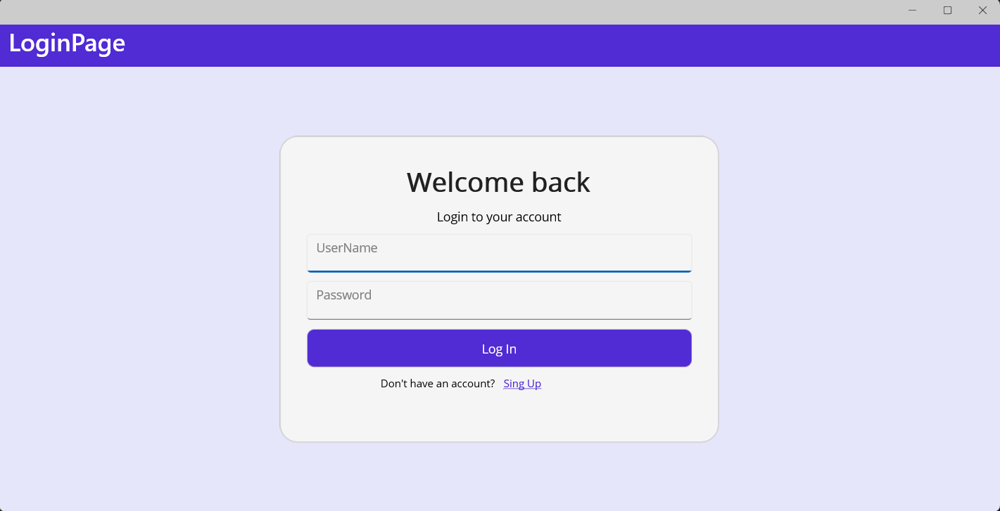

# Library-manager-project  

## About

The automated library management system provides the ability to automate processes for libraries of any type and purpose.  
  
**The development was carried out using .NET MAUI**  

## Content
- [Description](#description)
- [Application Interface](#application-interface)
  - [SingIn&SingUp Pages](#singinsingup-pages)
  - [Main Page](#main-page)
  - [Details Page](#details-page)
  - [Orders Page](#orders-page)
- [UseCase Diagram](#usecase-diagram)
- [Class Diagram](#class-diagram)
- [Developers](#developers)
## Description
An automated library management system is a software solution designed to automate and optimize library processes. It provides tools for efficient inventory, cataloging, storage and retrieval of books, as well as management of checkout and return of materials, helping to improve library operations and provide a better patron experience. 

Design patterns such as MVVM, Repository and UnitOfWork were used. Connection to the database was made using the Entity Framework.  
## Application Interface
In the application, all users are divided into two roles: *administrators* and *readers*. All users have access to the book collection, and the user can also select a book and go to a page with more detailed information about the book. The reader can order books and view all their orders on a separate page. The administrator has access to add, delete and edit information about books stored in the library. A user with the administrator role can view lists of ordered and issued books.
### SingIn&SingUp Pages

  
  

 

### Main Page
After successful registration or authorization, the user is redirected to the main page (see pic.). This page displays a list of all books held by the library. The list elements themselves contain the Id of the book, its title and the number of books currently available.  

### Details Page
Double clicking on a book will take you to a page with detailed information.  

### Orders Page
The reader has the opportunity to order a book by clicking on the “Order” button. The book will be added to the user's order list

## UseCase Diagram

## Class Diagram

## Developers

- [EcLerk](https://github.com/EcLerk)
